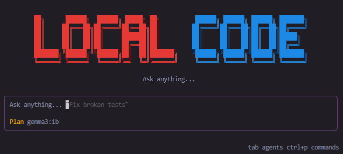

# Agent - Local Code Assistant



Unfortunately, we did not have access to Claude Code's source code for the development of this project.
A local code assistant that uses Ollama and LMStudio to run language models with tool calling capabilities. Complete system with terminal interface (TUI), API server, and persistent session management.

## 🚀 Quick Start

### Prerequisites

1. **Node.js 20+** (check with `node --version`)
2. **pnpm 10.30.0+** (install with `npm install -g pnpm`)
3. **AI Provider** (choose one):
   - **Ollama** ([ollama.ai](https://ollama.ai)) - Recommended, easy to use
   - **LMStudio** ([lmstudio.ai](https://lmstudio.ai)) - Alternative with graphical UI

### Installation

````bash
# Clone the repository
git clone <repo-url>
cd local-code

# Install dependencies
pnpm install

# Build the project
pnpm build

# Option A: Use Ollama (recommended)
ollama pull qwen2.5:7b        # Best quality/speed balance
ollama pull llama3.2:3b       # Fast, good for simple tasks
ollama pull gemma2:9b         # High quality, requires more RAM

# Option B: Use LMStudio
# 1. Download and install LMStudio from lmstudio.ai
# 2. Download a compatible model from the UI
# 3. Start the local server in LMStudio (port 1234)
# See docs/lmstudio-integration.md for more details
```

### Starting the Application

```bash
# Start everything with one command (automatic CLI wrapper)
pnpm dev

# The CLI wrapper:
# 1. Verifies Node.js ≥20
# 2. Starts the server in background
# 3. Waits for server to respond (health check)
# 4. Starts the TUI
# 5. Coordinates shutdown when you exit

# Alternatively, start components separately:
pnpm dev:server    # Server only (port 3000)
pnpm dev:tui       # TUI only (requires server running)
```

### Usage

1. **Models Screen** (Tab 1):
   - Select a model with arrow keys ↑↓
   - Press Enter to activate it
   - Verify that ★ appears next to the active model
   - ⚠️ Automatic warning for models >8GB

2. **Chat Screen** (Tab 2):
   - Type your question or command
   - The agent uses tools automatically:
     - `read_file` - Read files (with path validation)
     - `write_file` - Create/modify files (with size limits)
     - `edit_file` - Edit existing files
     - `bash` - Execute commands (safe command whitelist)
     - `list_files` - List directories
     - `search_files` - Search in files (with ReDoS protection)
   - Automatic recovery from SSE disconnections
   - Token throttling (50ms) for smooth performance

3. **Sessions Screen** (Tab 3):
   - View conversation history
   - Continue previous sessions
   - Delete sessions
   - Dynamically generated titles

### Operation Modes

- **Plan Mode** (default): Agent asks permission before executing destructive commands
- **Build Mode**: Agent executes commands automatically with 500ms delay
- Critical operations (rm, format, .git, .env) always require confirmation

Switch between modes with `Ctrl+M`.

---

## 📁 Project Structure

```
local-code/
├── packages/
│   ├── server/      # REST API + Agent Loop + Tools
│   │   ├── src/agent/       # ReAct Loop, parser, permissions
│   │   ├── src/ai/          # Providers (Ollama, LMStudio)
│   │   ├── src/db/          # Drizzle ORM + SQLite
│   │   ├── src/lib/         # Error handler, logger, shutdown
│   │   ├── src/routes/      # HTTP Endpoints
│   │   └── src/tools/       # 6 agent tools
│   ├── sdk/         # TypeScript Client + SSE
│   ├── tui/         # Terminal UI (Ink + Zustand)
│   └── shared/      # Shared types and constants
├── scripts/         # Validation scripts (models, ANSI, perf)
├── docs/            # Phase documentation + test specs
├── auditoria-seguridad/  # Security audit and fixes
└── .husky/          # Git hooks (commitlint, pre-commit)
```

---

## 🧪 Testing

```bash
# Run all tests
pnpm test

# Tests per package
pnpm --filter @agent/server test
pnpm --filter @agent/sdk test
pnpm --filter @agent/tui test
```

### Validation Scripts

```bash
# Check ANSI color support in your terminal
node scripts/test-ansi.ts

# Validate model compatibility with tool calling
node scripts/test-models.ts

# TUI performance benchmark
node scripts/test-ink-perf.ts
```

### Test Coverage

- Phase 1: 33 tests (base server + DB)
- Phase 2: 52 tests (SDK + TUI)
- Phase 3: 128 tests (tools + agent loop)
- Phase 4: 127 tests (chat + sessions)
- Total specified: 340 tests

---

## 🔧 Development

### Build

```bash
# Build all packages
pnpm build

# Build a specific package
pnpm --filter @agent/server build
```

### Linting, Formatting and Type Checking

```bash
# Lint (ESLint with TypeScript + React + Prettier)
pnpm lint
pnpm lint:fix

# Format (Prettier)
pnpm format
pnpm format:check

# Type checking
pnpm typecheck

# Spell checking
pnpm spell-check
```

### Commits

This project uses [Conventional Commits](https://www.conventionalcommits.org/):

```bash
# Use the commit assistant
pnpm commit

# Or manually
git commit -m "feat: add new feature"
git commit -m "fix: fix chat bug"
git commit -m "docs: update README"
```

---

## 📚 Documentation

### Configuration

- [ESLint Setup](docs/eslint-setup.md)
- [Prettier Setup](docs/prettier-setup.md)
- [Git Hooks Setup](docs/git-hooks-setup.md)

**Total**: 340 tests specified

### Security Audit

- [Identified Vulnerabilities](auditoria-seguridad/01-vulnerabilidades.md)
- [Remediation Plan](auditoria-seguridad/02-plan-de-remediacion.md)
- [Preventive Controls](auditoria-seguridad/03-controles-preventivos.md)
- [Executive Summary](auditoria-seguridad/04-resumen-ejecutivo.md)

---

## 🐛 Troubleshooting

### Error: "Ollama is not available" / "LMStudio is not available"

**Cause**: The AI provider is not running or not responding.

**Solution for Ollama**:

```bash
# Start Ollama
ollama serve

# Verify it's running
curl http://localhost:11434/api/tags
```

**Solution for LMStudio**:

1. Open LMStudio
2. Go to the "Local Server" tab
3. Load a model
4. Click "Start Server" (default port 1234)
5. Verify: `curl http://localhost:1234/v1/models`

The system automatically detects when the provider is not available and displays a clear message in the TUI.

See [docs/lmstudio-integration.md](docs/lmstudio-integration.md) for detailed LMStudio configuration.

### Performance Optimizations

- Virtualization (only last 50 messages when >50)
- React.memo on heavy components

### Debugging Logs

```bash
# View server logs (development)
LOG_LEVEL=debug pnpm dev:server

# Production logs (JSON)
NODE_ENV=production pnpm dev:server
```

For more issues, see [docs/troubleshooting.md](docs/troubleshooting.md).

---

## 🏗️ Architecture

### Technology Stack

- **Backend**: Hono + Drizzle ORM + SQLite
- **AI**: Vercel AI SDK + Ollama (LMStudio support)
- **Frontend**: Ink (React for terminal) + Zustand
- **Monorepo**: pnpm workspaces + Turbo
- **Linting**: ESLint + TypeScript ESLint + React plugins
- **Formatting**: Prettier (integrated with ESLint)
- **Testing**: Vitest + fast-check (property-based testing)
- **Logging**: Pino (structured logging)
- **Git Hooks**: Husky + Commitlint
- **Language**: TypeScript

### Development Commands

```bash
# Development
pnpm dev                    # Start everything (CLI wrapper)
pnpm dev:server             # Server only
pnpm dev:tui                # TUI only
pnpm build                  # Build all packages
pnpm test                   # Run tests
pnpm typecheck              # Check TypeScript types

# Linting and Formatting
pnpm lint                   # Run ESLint on entire monorepo
pnpm lint:fix               # Auto-fix ESLint errors
pnpm format                 # Format code with Prettier
pnpm format:check           # Check format without modifying
pnpm spell-check            # Check spelling

# Commits
pnpm commit                 # Commit assistant (Conventional Commits)

# Per package
pnpm --filter @agent/sdk lint
pnpm --filter @agent/server format
pnpm --filter @agent/tui lint:fix
```

For more information:

- ESLint: [docs/eslint-setup.md](docs/eslint-setup.md)
- Prettier: [docs/prettier-setup.md](docs/prettier-setup.md)
- Git Hooks: [docs/git-hooks-setup.md](docs/git-hooks-setup.md)

### Data Flow

```
TUI (Ink) → SDK Client → Server API → Agent Loop → AI Provider (Ollama/LMStudio)
                                    ↓
                                SQLite (sessions, messages)
```

### Supported AI Providers

The system supports multiple AI providers through Vercel AI SDK:

1. **Ollama** (default)
   - Port: 11434
   - Endpoint: `http://localhost:11434`
   - Model management: CLI (`ollama pull`, `ollama list`)
   - Documentation: [docs/lmstudio-integration.md](docs/lmstudio-integration.md)

2. **LMStudio**
   - Port: 1234
   - Endpoint: `http://localhost:1234/v1`
   - Model management: Graphical UI
   - OpenAI API compatible
   - Documentation: [docs/lmstudio-integration.md](docs/lmstudio-integration.md)

The server automatically detects which provider is available and adapts accordingly.

### Agent Flow

1. User sends message
2. Agent analyzes and decides if it needs a tool
3. If tool needed:
   - In Plan mode: asks permission
   - In Build mode: executes with delay
4. Executes tool and gets result
5. Agent analyzes result and continues or responds
6. All messages are persisted in SQLite

---

## 🎯 Roadmap

### ✅ Completed (Phases 0-5)

- [x] Monorepo with pnpm + Turbo
- [x] Hono server with models, chat and sessions endpoints
- [x] SQLite database with Drizzle
- [x] Client SDK with SSE support and resync
- [x] Complete TUI with 3 screens (Models, Chat, Sessions)
- [x] 6 agent tools with security validation
- [x] Complete ReAct loop with loop detection
- [x] Plan/build modes with critical permissions
- [x] Context compaction
- [x] CLI wrapper with health check and coordinated shutdown
- [x] Structured logging with Pino
- [x] Graceful shutdown
- [x] Robust error handling (Ollama, SSE, tools)
- [x] Automatic recovery from SSE disconnections
- [x] Performance optimizations (throttling, virtualization, memo)
- [x] Dynamic session titles
- [x] Warnings for large models
- [x] Git hooks (commitlint, pre-commit)
- [x] Security audit (10/15 vulnerabilities fixed)

### 🔒 Implemented Security

- [x] Path validation (anti path-traversal)
- [x] Bash command whitelist
- [x] Prompt injection protection
- [x] Secret redaction in logs
- [x] Environment variable filtering
- [x] ReDoS protection in regex
- [x] Mandatory critical permissions
- [x] Improved loop detection
- [x] Timeouts on file operations
- [x] Stack traces only in development

### 📋 Pending

- [ ] Database encryption (VULN-008)
- [ ] Rate limiting (VULN-009)
- [ ] Real compaction with LLM (VULN-013)
- [ ] Static analysis with eslint-plugin-security
- [ ] Security metrics
- [ ] Compatible models documentation (MODELS.md)

---

## 🤝 Contributing

1. Fork the repository
2. Create a branch: `git checkout -b feature/new-feature`
3. Commit your changes: `pnpm commit`
4. Push to the branch: `git push origin feature/new-feature`
5. Open a Pull Request

---

## 📄 Licencia

MIT

---

## � Seguridad

Este proyecto implementa múltiples capas de seguridad:

- Validación de paths para prevenir path traversal
- Whitelist de comandos bash permitidos
- Protección contra prompt injection con delimitadores XML
- Redacción automática de secretos en logs
- Protección ReDoS en búsquedas con regex
- Permisos críticos obligatorios (incluso en modo build)
- Timeouts en operaciones de archivos
- Detección mejorada de loops infinitos

Para más detalles, consulta la [auditoría de seguridad](auditoria-seguridad/README.md).

---

## 🙏 Acknowledgments

- [Ollama](https://ollama.ai) - Local language models
- [Vercel AI SDK](https://sdk.vercel.ai) - AI Framework
- [Ink](https://github.com/vadimdemedes/ink) - React for terminal
- [Hono](https://hono.dev) - Ultra-fast web framework
- [Drizzle](https://orm.drizzle.team) - TypeScript ORM
- [Pino](https://getpino.io) - Structured logging
- [Vitest](https://vitest.dev) - Testing framework
- [Turbo](https://turbo.build) - Build system for monorepos

---

```

```
````
